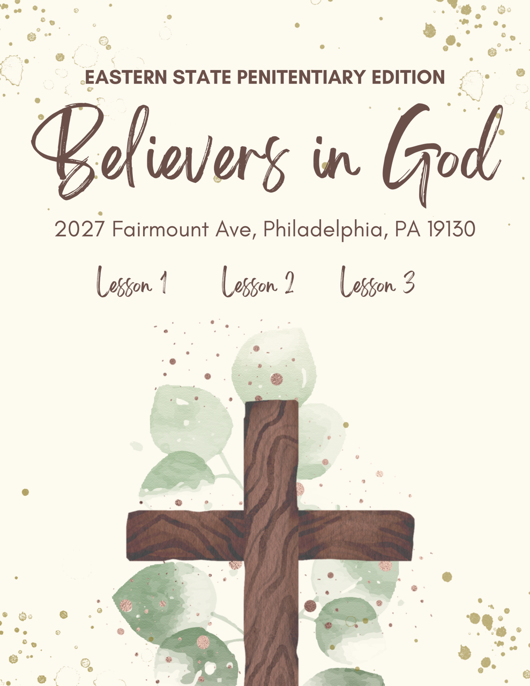

# My Exploration of Digital Humanities

Hello world! This is my page. Welcome!!
I am Daniel and I'm a researcher in the field of digital humanities. I have been a student in ENGL 1650 Introduction to Digital Humanities throughout Fall 2024 semester, and this is my final portfolio highlighting my hard work throughout the past four months. 

## About Me

This is a page redirecting you to some details [about myself](about.html). Enjoy!

## Looking Forward

I've outlined some things I would like to explore in the realm of digital humanities.
This is the statement to where [I will be discussing what I am looking forward to](lookingforward.html).

## My EC Project

Here is the link to some [reflections on my collaborative EC project](myecproject.html)!

