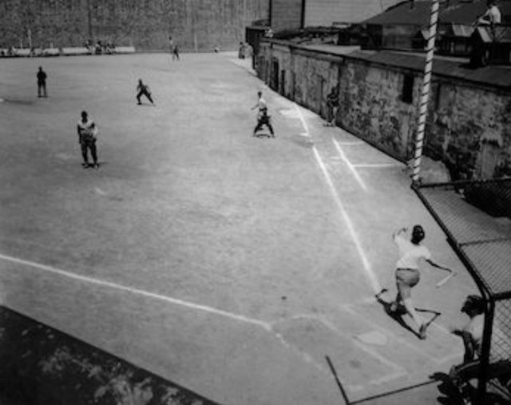

# Below is a reflection statement regarding my work in Printings in Prison and Collaborative EC project!

When we first began our semester, I expected digital humanities to be a simple extension to the field of humanities with a small touch of digital aspect. However, as I delved deeper into the individual projects, I learned that digital humanities makes the data more accessible and interactive for the audience. Like how each group focused on textile/texture, fabrication, and interactivity, digital humanities not only just delivers us information but also makes the information more open and comprehensive. Some themes that emerged throughout the semester were curation, interdisciplinary, accessibility, and digital tools.

When working on the first project, OCRing the original document from Pennsylvania’s prison online database, I realized that transforming somewhat hard-to-read documents to comprehensible paragraphs is key to the role of digital humanities. The visit to the Kislak Center and SCETI (Schoenberg Center for Electronic Text and Image) opened my eyes to various techniques in preserving original documents and transferring them to online databases for wider user experience. The video “A (re)introduction to Book Digitization at the Internet Archive” taught me the concepts like structural metadata and helped me review OCR using ABBYY FineReader or the Tesseract. When I OCRed the metadata from the online database, I encountered multiple typos using Tesseract, so I realized that digital humanities is not all about inputting a document to a computer technology – it still requires human curation and error checks.

Moving onto the second project, which was composing a multimedia essay for the Printing in Prisons website, I was a little confused by the meaning of a multimedia essay because I had prior experience only on writing scholarly papers. However, I soon realized that a multimedia essay is a form of writing with a touch of interactivity or creativity. I, as a Christian believer myself, was curious about how inmates at the Eastern State Penitentiary gathered for religious services, and decided to make each section a “lesson” or a “prayer” from the excerpts of The Umpire. Collecting data included looking at the Ancestry.com, searching for Creative Commons images, looking back at the Eastern State Penitentiary visit, and listening to audios or music recordings. The video by Damon McCool on The Umpire and Printing in Prisons helped me understand the purpose and goal of this project, and gave me a sense of which section of The Umpire I should focus on. I also looked into the digital photographs and dataset to find potential images/sources for my blog. After gathering data, I put together everything on a Markdown file for the blog to show up as a html page. Learning about Markdown and its syntax was similar to the Python for Humanists workshop, as both the techniques use Markdown and Jupyter applications to put together a blog post or an article in a more interactive digital format. While working on the project, I realized that these projects are interconnected in a way that we are gathering information from various digital databases and putting together a coherent article using coding techniques.

The collaborative EC project was something different in a way that we were not using Markdown, OCR, or any computer technology. I was assigned to an Interactivity Team, so we used NFC tags and 3D printed out a baseball field to make baseball stories from The Umpire more interactive and interesting. This was a similar experience to the cassette workshop in a way that we made something more tangible and physical and we could have firsthand user experience. For the cassette tape workshop, I was able to play around with the cassette player and record my own music. For our collaborative EC project, we 3D printed out a baseball field and put NFC tags on each base that linked to pdf articles about a 1913 ESP baseball league season. We made the article reading experience more interactive and special, and I learned that digital humanists should be able to provide a special user experience for a wider range of audience.

I discovered a new interest during the semester, as I enjoyed playing with different features that made composing and reading both more interesting and special. Learning about different types of Markdown syntax made my blog post more accessible for the audience, and putting NFC tags on a physical 3D printed object made the audience feel like they are in the ESP baseball field, making the reading experience more enjoyable. I believe that I did well both in my own work and the collaborative work, as I loved brainstorming creative ideas and ways to make my project more special. My Printing in Prisons blog and EC project both required a tremendous amount of research and writing/editing, but in the end, I do not regret much on how I would have done differently. I would have liked to learn more about Markdown techniques and computer languages, but I can continue to learn these skills on my own or by taking an online course. Overall, I am very satisfied with my projects in digital humanities.

Below are some pictures taken during a workshop or while working on a project:

Enjoy reading a separate [reflection on my collaborative EC project with photos](myecproject.html)!
